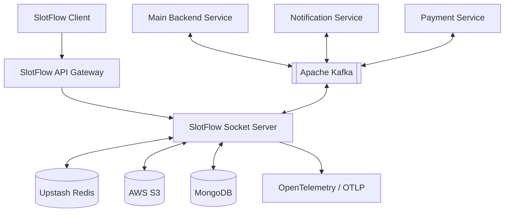

<div align="center">

# SlotFlow Socket Service

### Real-time communication, simplified.

A dedicated real-time communication microservice powering SlotFlow's messaging, presence, appointment coordination, WebRTC signaling, and event-driven workflows.

  
  
  
  
  

---

### Live link & Repositories

  <a href="https://slotflow.online">
    
  </a>
  <a href="https://github.com/slotflow">
    
  </a>

### Technology Stack

  
  
  
  
  
  
  
  
  
  
  
  
  


  
  
  

</div>

---

## Overview

The **SlotFlow Socket Service** is a real-time communication microservice within the SlotFlow appointment booking platform. It provides Socket.IO-based communication and HTTP endpoints for messaging and related real-time workflows.

The service integrates with MongoDB for persistent message data, Upstash Redis for transient state and coordination, Apache Kafka for event-driven processing, and AWS S3 for chat image storage.

It also provides socket namespaces for chat, application events, and video signaling, allowing real-time communication workloads to operate independently of the main application backend.

The service is deployed on **AWS EC2** and integrates with the broader SlotFlow backend architecture.

---

## Core Features

### Real-Time Messaging

- One-to-one messaging using Socket.IO
- Dedicated chat namespace
- HTTP endpoints for retrieving and sending messages
- Chat image uploads
- Image storage using AWS S3
- Signed URLs for accessing stored images
- Persistent message storage in MongoDB

### Socket Connection Management

- Dedicated Socket.IO namespaces
- Real-time connection and disconnection handling
- User-related socket state
- Redis-backed transient socket data
- Chat presence and typing-related state

### Video Signaling

- Dedicated video namespace
- Socket-based signaling events for WebRTC workflows
- Real-time signaling communication between connected clients

The service provides signaling transport; media transport itself is handled by the WebRTC clients and their associated network infrastructure.

### Application Events

- Dedicated events namespace
- JWT-cookie verification for the events namespace
- Subscription-related event processing
- Real-time application event delivery

### Appointment Slot Coordination

- Redis-backed appointment slot locks
- Temporary lock expiration
- Coordination for provider appointment slot workflows

The configured slot-lock TTL is 15 minutes.

### Event-Driven Processing

- Kafka consumer integration
- Subscription event processing
- Processed-event tracking in MongoDB
- Retry and dead-letter processing workflows
- Configurable Kafka topics and consumer groups

### Observability

- OpenTelemetry instrumentation
- OTLP-based telemetry export
- Application logging using Winston
- Metrics collection
- Distributed tracing integration

---

## Technology Stack

### Runtime & Backend

<p align="left">
  
  
  
  
  
  
</p>

### Data & Messaging

<p align="left">
  
  
  
  
  
  
</p>

### Storage & Security

<p align="left">
  
  
  
</p>

### Logging & Observability

<p align="left">
  
  
  
</p>

### Infrastructure & Deployment

<p align="left">
  
  
  
</p>

---

## Architecture

The Socket Service sits behind the SlotFlow API Gateway and provides real-time communication and message-related HTTP endpoints.



### Architecture Principles

- Dedicated microservice for real-time workloads
- Socket.IO namespaces for separating communication domains
- HTTP endpoints for message operations
- MongoDB for persistent message and processed-event records
- Redis for temporary state and slot coordination
- Kafka for asynchronous event processing
- AWS S3 for chat image storage
- OpenTelemetry for application telemetry
- Environment-based service configuration

---

## Socket Namespaces

The service exposes three Socket.IO namespaces.

| Namespace | Purpose                                             |
| --------- | --------------------------------------------------- |
| `/chat`   | Real-time chat, presence, and typing-related events |
| `/events` | Application and subscription-related events         |
| `/video`  | WebRTC signaling communication                      |

### Chat Namespace

The chat namespace supports real-time messaging and related communication state.

Implemented event names identified during codebase inspection include:

- `sendMessage`
- `receiveMessage`
- `typing`
- `stopTyping`
- `joinRoom`
- `leaveRoom`

The precise payloads and acknowledgement behavior should be taken from the corresponding event handlers and shared event types in the source code.

### Events Namespace

The events namespace handles application-level real-time events, including subscription-related workflows.

Authentication for this namespace uses JWT verification through the token cookie.

### Video Namespace

The video namespace provides signaling communication used by WebRTC workflows.

It transports signaling messages between connected clients; it does not itself provide a media server.

---

## Data & Infrastructure

### MongoDB

MongoDB stores persistent data used by the service.

Identified data includes:

- Chat messages
- Processed Kafka event records

Processed-event records support tracking of Kafka events that have already been handled.

### Upstash Redis

Redis stores temporary state and coordination data.

Identified use cases include:

- Chat presence
- Appointment slot locks
- Signed URL caching
- Socket-related state cleanup

The configured appointment slot-lock TTL is **15 minutes**.

Socket cleanup targets keys matching `socket:*`; this should not be interpreted as a complete cleanup of every key used by the service.

### Apache Kafka

Kafka provides asynchronous event consumption.

The service includes:

- Configurable broker and consumer group settings
- Configurable subscription topic handling
- Processed-event tracking
- Retry and dead-letter processing

The subscription event handler identified during inspection processes `planSubscribed`. A Stripe-account-status topic is configured, but a corresponding mapped handler was not identified in the inspected code.

### AWS S3

AWS S3 is used for chat image storage.

The service supports generating signed URLs for image access, with expiration controlled through configuration.

---

## Security & Authentication

Authentication behavior differs by transport and namespace. Clients and gateway configuration must account for these differences.

| Interface           | Identified authentication behavior                                      |
| ------------------- | ----------------------------------------------------------------------- |
| HTTP message routes | Middleware reads identity headers such as `x-user-id` and `x-user-role` |
| `/events`           | Verifies a JWT supplied through a token cookie                          |
| `/chat`             | Uses user identity supplied through headers or query parameters         |
| `/video`            | Uses user identity supplied through headers or query parameters         |

## Observability

The service integrates with OpenTelemetry for telemetry collection and OTLP export.

### OpenTelemetry

Used for instrumentation and exporting supported telemetry to a configured collector or endpoint.

### Winston

Winston provides application logging.

### Metrics

The inspected configuration schedules metrics collection at a 10-second interval.

Actual metric availability depends on the instrumentation and exporter configuration.

## Project Structure

The service is organized around its server entry point, socket namespaces, HTTP routes, configuration, integrations, data models, and observability components.

```text
slotflow-socket/
│
├── src/
│   ├── server.ts
│   ├── express.d.ts
│   ├── config/
│   ├── presentation/
│   ├── infrastructure/
│   ├── domain/
│   ├── application/
│   ├── app/
│   ├── shared/
│   └── ...
│
├── Dockerfile
├── package.json
├── pnpm-lock.yaml
├── tsconfig.json
├── .env
└── README.md
```

This is a conceptual overview. Keep the tree synchronized with the actual directories and files in the repository.

---

## Related Services

The Socket Service integrates with other services in the SlotFlow platform.

<p align="left">
  <a href="https://github.com/slotflow/slotflow-client">
    
  </a>
  <a href="https://github.com/slotflow/slotflow-api-gateway">
    
  </a>
  <a href="https://github.com/slotflow/slotflow-backend-main">
    
  </a>
  <a href="https://github.com/slotflow/slotflow-payment">
    
  </a>
  <a href="https://github.com/slotflow/slotflow-api-notification">
    
  </a>
  <a href="https://github.com/slotflow/slotflow-infra">
    
  </a>
</p>

---

## Project Highlights

- Dedicated real-time communication microservice
- Socket.IO namespaces for chat, application events, and video signaling
- HTTP message endpoints
- MongoDB-backed message persistence
- Redis-backed transient state and slot locks
- Kafka event consumption and processed-event tracking
- Retry and dead-letter processing workflows
- AWS S3 chat image storage
- Signed URL support
- OpenTelemetry instrumentation and OTLP export
- Winston application logging
- TypeScript-based Node.js implementation
- AWS EC2 deployment

---

## License

**Proprietary — All Rights Reserved**

Copyright © 2026 SlotFlow.

The SlotFlow Socket Service source code and associated assets are proprietary and confidential property of SlotFlow Technologies Private Limited.

No permission is granted to use, copy, modify, redistribute, sublicense, or commercialize this software without explicit written permission from SlotFlow.

Viewing the source code does not grant any license or rights to use, modify, distribute, or deploy the software.

All rights reserved.

---

<div align="center">

### SlotFlow Socket Service

**Real-time communication, simplified.**

<a href="https://slotflow.online">Live Application</a>
·
<a href="https://github.com/slotflow">GitHub Organization</a>

© 2026 SlotFlow Technologies Private Limited

</div>
